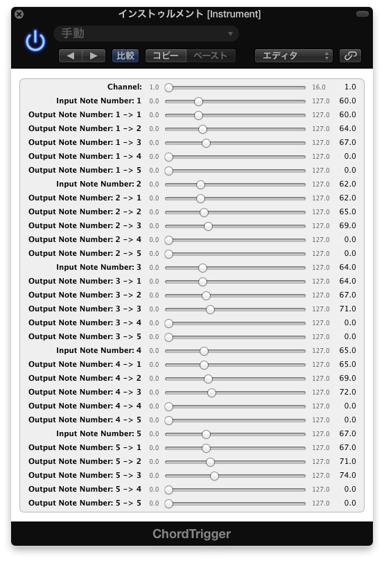

ChCopy
============

Copy MIDI Signal to Another Channel

This MIDI FX Plugin copy MIDI signal from a channel to the another channel.

## Installation

Generally, Audio Units Plugins are available for only Mac OSX.

1. Click "Download ZIP" and extract ChCopy.component.
2. Move ChCopy.component to /Library/Audio/Plug-Ins/Components

## Available DAW

* Logic Pro X
* Mainstage 3

## License

ChCopy has an MIT Licence http://en.wikipedia.org/wiki/MIT_License
